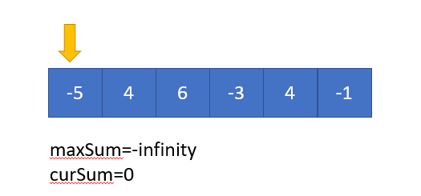
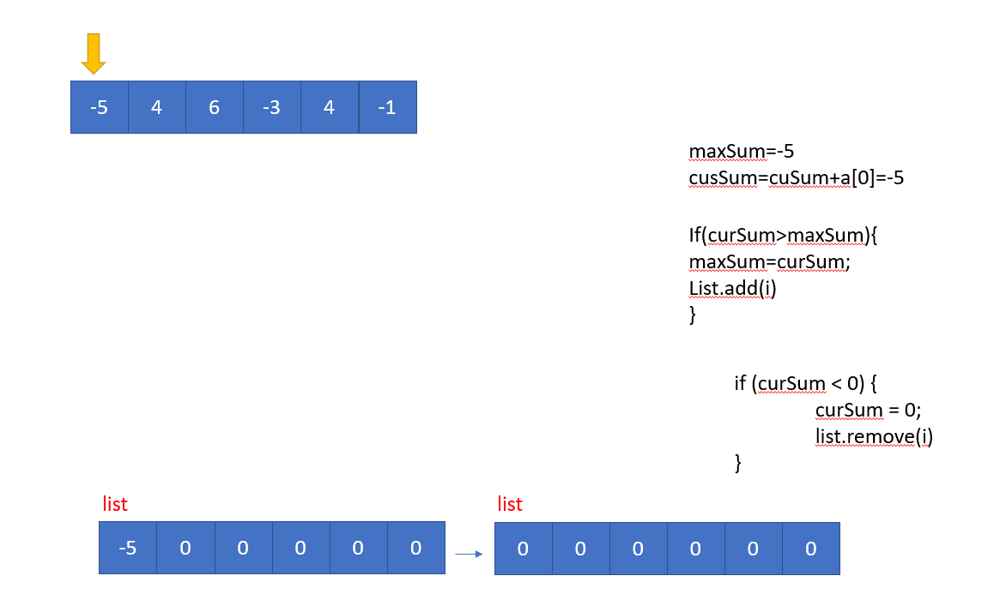
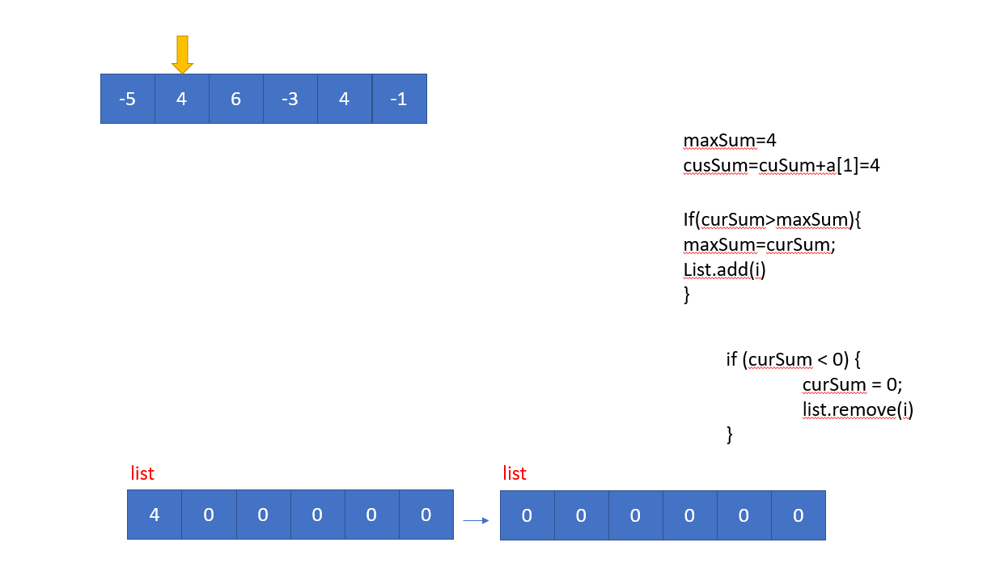
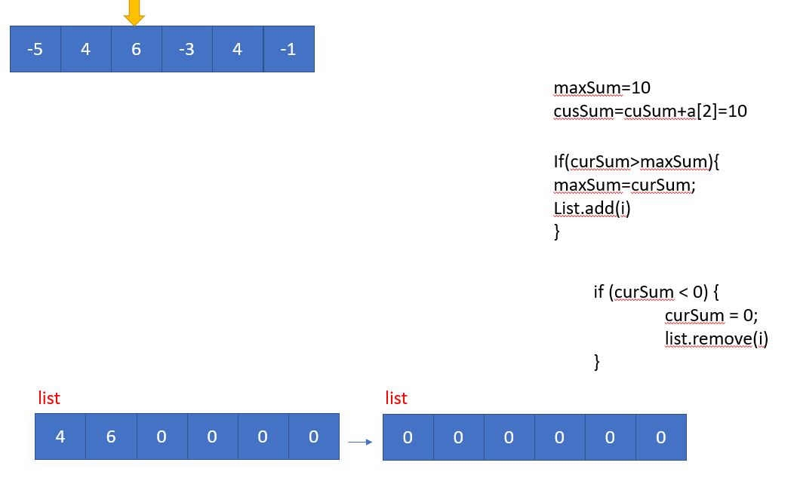
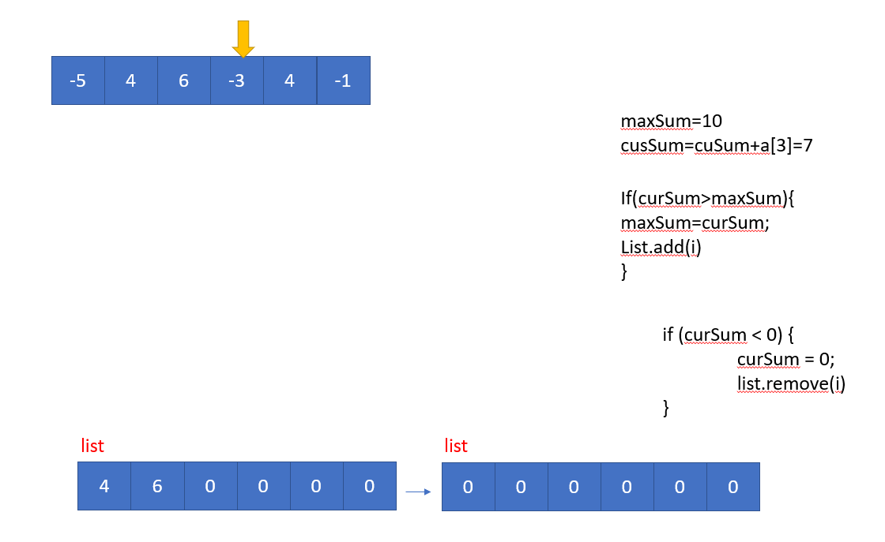
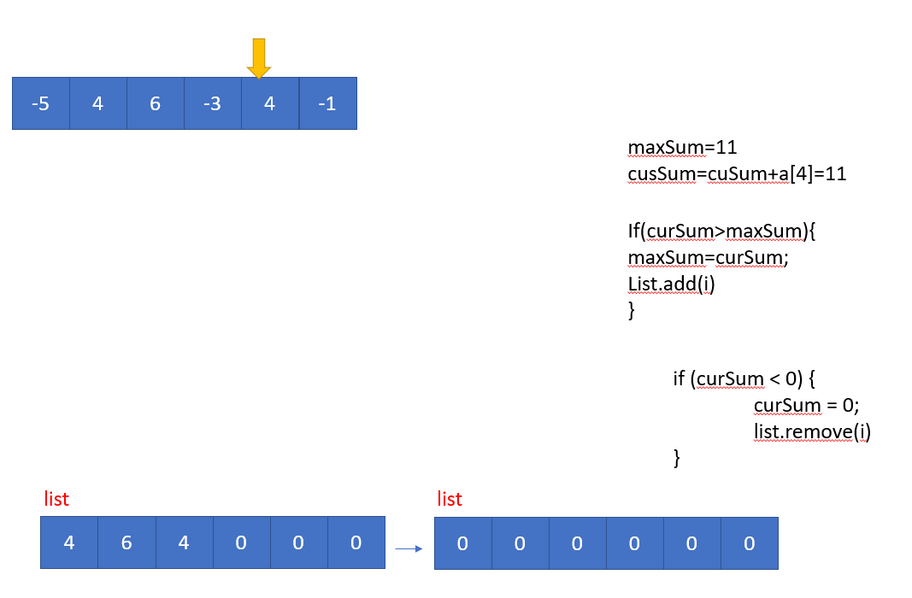
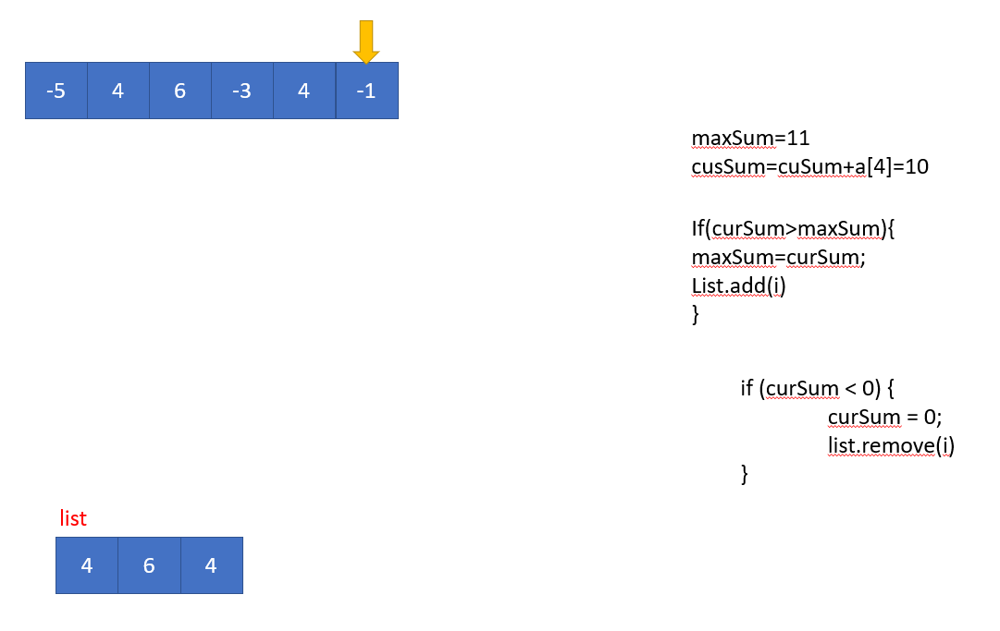
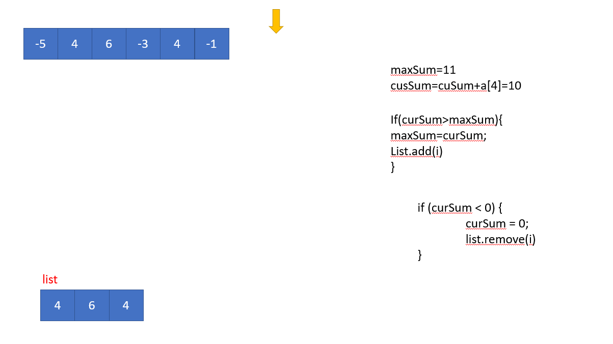

# Kadan's Algorithm

Given an array Arr[] of N integers. Find the contiguous sub-array(containing at least one number) which has the maximum sum and return its sum.

Example 1:

Input:
N = 5
Arr[] = {1,2,3,-2,5}
Output:
9
Explanation:
Max subarray sum is 9
of elements (1, 2, 3, -2, 5) which
is a contiguous subarray.
Example 2:

Input:
N = 4
Arr[] = {-1,-2,-3,-4}
Output:
-1
Explanation:
Max subarray sum is -1
of element (-1)

Your Task:
You don't need to read input or print anything.
The task is to complete the function maxSubarraySum() 
which takes Arr[] and N as input parameters and returns the sum of
subarray with maximum sum.
<table>
<tr>

<td>

</td>

<td>

</td>
</tr>

<tr>

<td>

</td>

<td>

</td>
</tr>

<tr>

<td>

</td>

<td>

</td>
</tr>

<tr>

<td>

</td>

<td>

</td>
</tr>

</table>
