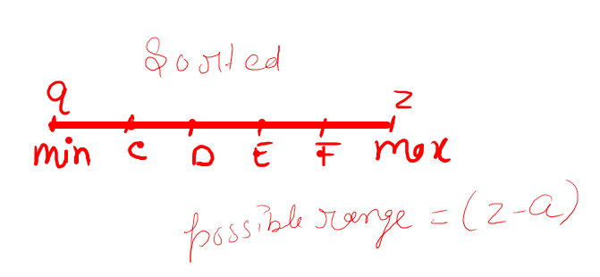

# Minimize The maximum difference Between Two Tower heights
[Leetcode](https://leetcode.com/problems/smallest-range-ii/) 
[GFG](https://practice.geeksforgeeks.org/problems/minimize-the-heights3351/1) 
Given an array arr[] denoting heights of N towers and a positive integer K.

For each tower, you must perform exactly one of the following operations exactly once.

Increase the height of the tower by K
Decrease the height of the tower by K
Find out the minimum possible difference between the height of the shortest and tallest towers after you have modified each tower.

You can find a slight modification of the problem here.
Note: It is compulsory to increase or decrease the height by K for each tower. After the operation, the resultant array should not contain any negative integers.

Example 1:

Input:
K = 2, N = 4
Arr[] = {1, 5, 8, 10}
Output:
5
Explanation:
The array can be modified as
{3, 3, 6, 8}. The difference between
the largest and the smallest is 8-3 = 5.
Example 2:

Input:
K = 3, N = 5
Arr[] = {3, 9, 12, 16, 20}
Output:
11
Explanation:
The array can be modified as
{6, 12, 9, 13, 17}. The difference between
the largest and the smallest is 17-6 = 11.
## Solution linear time (O)n
### we can use concept of range Suppose there are two Numbers :

then we can calculate difference of maximum and minimum number (if array is sorted)
by `z-a` i.e` a[n-1]-a[0]`.

now we need to either increase or decrease the number by k.
we can evaluate the expression 
1) for adding k 
diff=`(z+k)-(a-k)`=`z+k-a+k`=`(z-a)+2k` -this will increase our difference,but we need to minimise it.
2) now let's try this-(a+k) & (z-k). 
diff=`(z-k)-(a+k)`=`z-k-a-k`=`(z-a)-2k`- this (-2k) will help us to minimise the result.

now it may be possibility that even if we increases (`a+k`) our maximum changes when (`z-k`) changes.
for eg. a[0]=7 and a[n-1]=9,where n is the length of  array,`7+3=10` and `9-3=6`( if `k=3`)
the difference=`10-6=4` , but perhaps there are more elements in array that could yield some other
better results. so the formula would be 
`int minEle=Math.min(a[0]+k,arr[i]-k)`- will calculate the minimum from current element and first element 
`int maxEle=Math.max(a[i-1]+k,arr[n-1]-k)`- will calculate the maximum and the result would be 
`res=Math.min(res,maxEle-minEle)`- minimise the maximum difference 